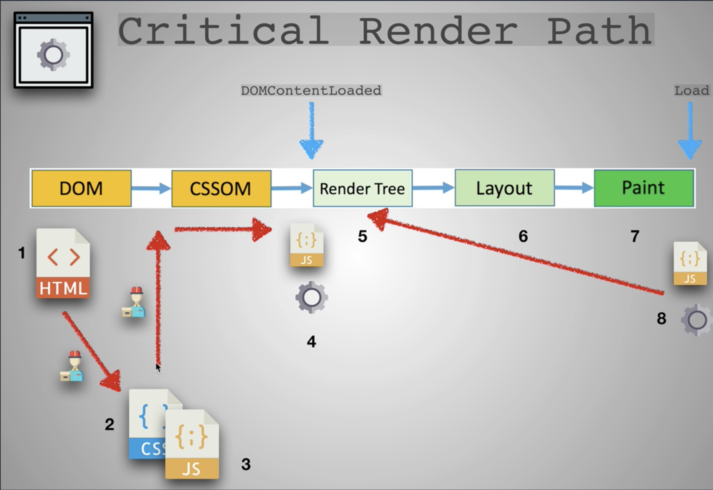
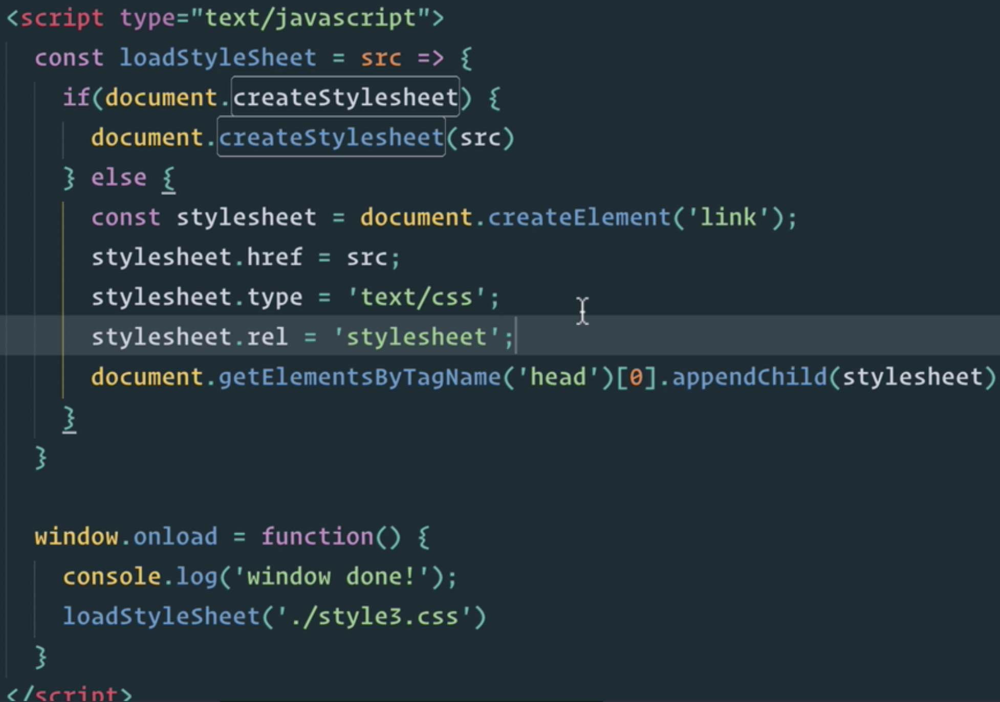
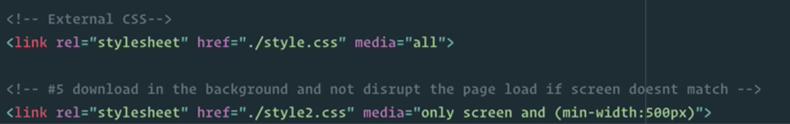
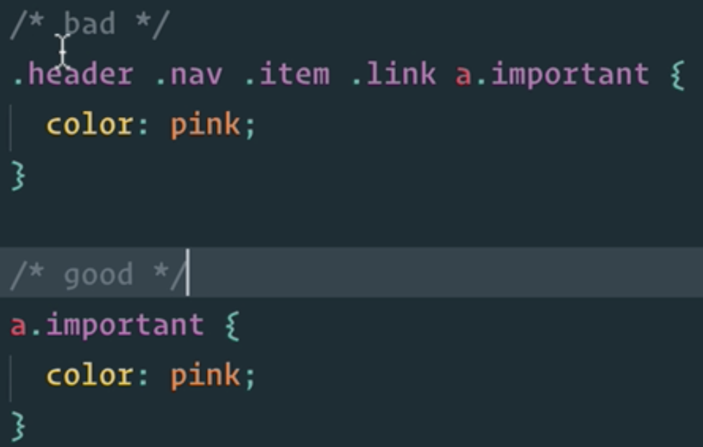
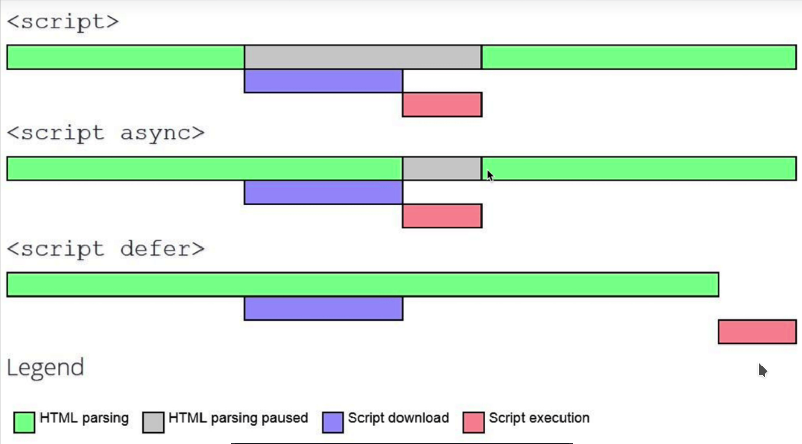
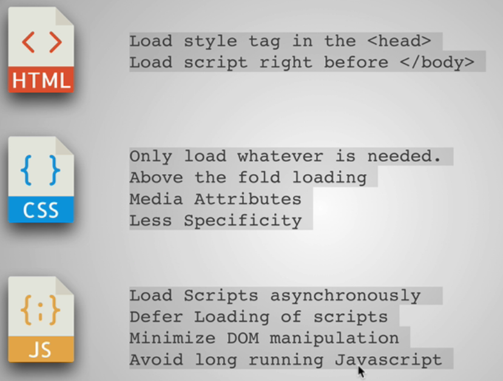

# Performance

## What happens when browsing ?

1.  Make a request to the server
2.  The server returns the HTML file
3.  The browser reads the file and loads the differents files (CSS files `link` tag, images, `scripts`)

## Keys to performance

- Improve the **client side**
  - Critical render path
  - Optimized code
  - PWA
- Improve the transfer of files and requests
  - Minimize files
  - Minimize Delivery
- Improve the backend
  - CDNs
  - Caching
  - Load balancing
  - GZIP
  - DB Scaling

## Network performance

### Honey I shrunk the files

We can minimize texts :

- Use `uglify.js` : removes the whitespace and so some bytes!

We can also minimize images :

- JPG : doesn't really allow transparency images. It's good for complex images with lots of colors.
- GIF : Looks grainy, limited colors : good for small animations.
- PNG : few sets of colors, good for logos.
- SVG : vector graphics, tend to be very simplistic.

Resources :

- https://99designs.com/blog/tips/image-file-types/
- https://pageweight.imgix.com/
- https://www.sitepoint.com/gif-png-jpg-which-one-to-use/

**Facts to remember**

- Transparency : PNG
- Animation : GIF
- Colourful : JPG
- Simple icons, logos, ... : SVG
- Reduce PNG with [TinyPNG](https://tinypng.com)
- Reduce JPEG with [JPEG Optimizer](http://jpeg-optimizer.com/)
- Choose simple illustrations over detailed photographs
- Lower JPEG image quality (30-60%)
- Resize image based on size it will be displayed
- Display different size images for different backgrounds : use mediaqueries for that (`@media screen and (min-width: ...px)`)
- Use CDNs like [imigx](https://www.imgix.com/)
- Remove metadata with a tool like [verexif](https://www.verexif.com/en/)

### The traveling delivery man

We need to limit the number of files we want to deliver

- Get rid of big frameworks like Bootstrap if not really necessary !
- Merge CSS files / JS files

## Critical render path

The browser parses the HTML and creates the DOM. Once it finds a style link, it asks the CSS file and continue building the DOM.

When it received all the CSS, it starts building the CSS tree model.

Then when it encounters script files, it executes them.

Once all is done, the brower combines the DOM and the CSS into a render tree. It uses it to figure out the layout.

- It's better to put `.js` files at the end of the `body` tag instead of in the `head` tag because it can block CSS parsing.

### Optimize CSS

- Only load whatever is needed
- Above the load folding : you don't want your browser to load stylesheets for something your users won't see immediately.

- Media attributes

- Less specificity

Finally, you can make your site load faster using intern `.css` files or inline styles.
But it can get pretty messy and you'll may have to copy paste a lot of CSS code.

### Optimize JavaScript

- Load scripts asynchronously

`<script async>` needs to be affect to anything that doesn't alter the DOM or the CSSOM : tracking scripts, Google Analytics scripts.

- We have to minimize the DOM manipulation because it triggers a re-render each time it is manipulated.

### Recap

**Resources**

- [Speed of website](https://developers.google.com/speed/pagespeed/insights)
- [Others performance tricks](https://css-tricks.com/prefetching-preloading-prebrowsing/)
- [Chrome DevTools](https://developers.google.com/web/tools/chrome-devtools/)
- [Lighthouse](https://developers.google.com/web/tools/lighthouse/)
- [Optimizilla](http://optimizilla.com/)
- [HTTP/2](https://developers.google.com/web/fundamentals/performance/http2/)
