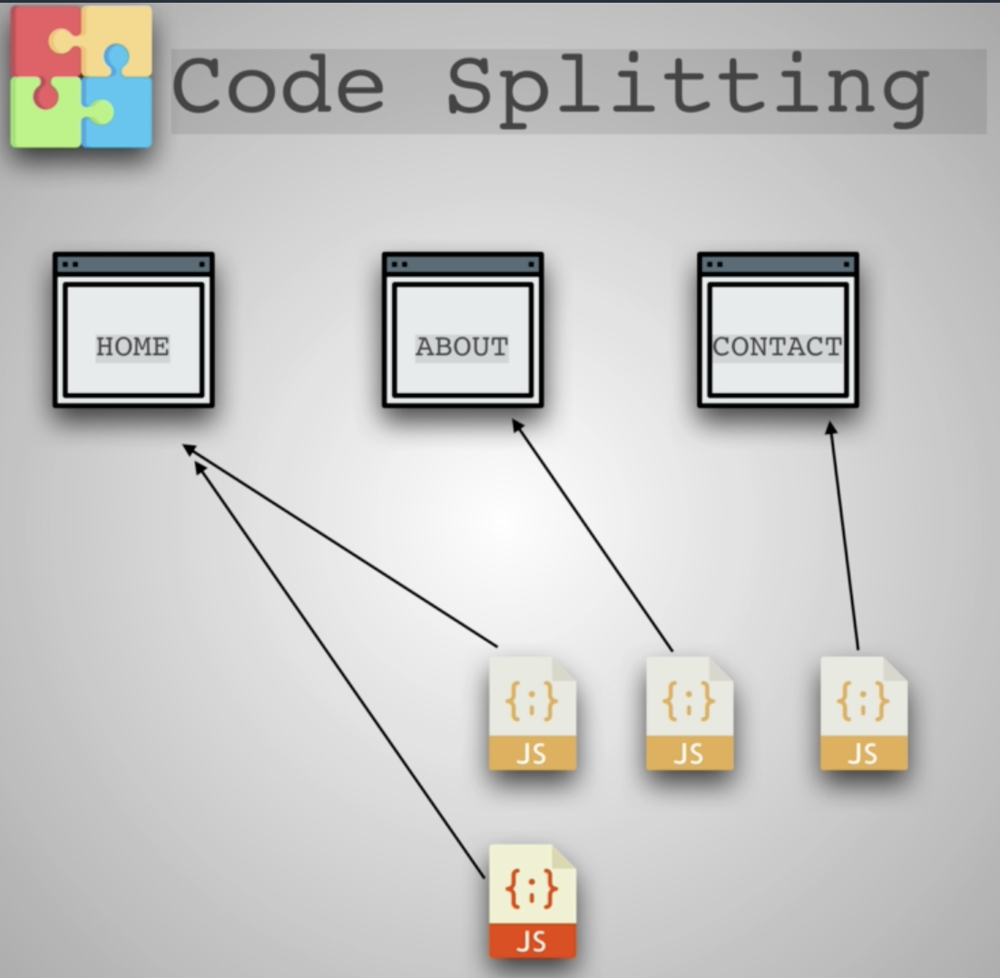
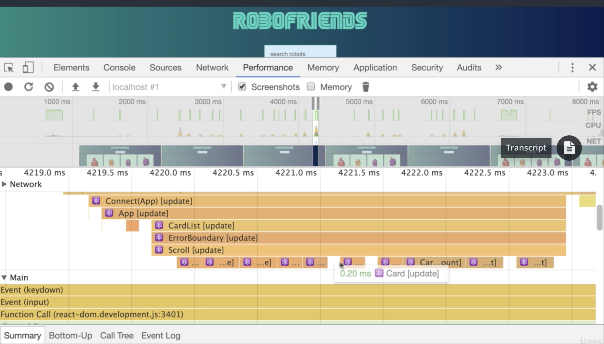
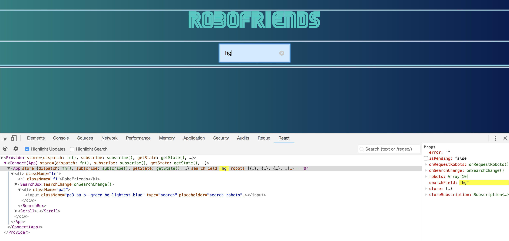
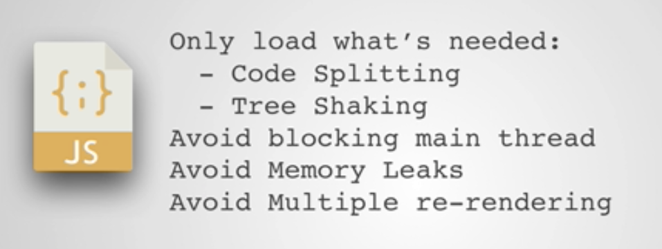

# Code splitting

We know how to bundle javascript files into one single file. But as it gets bigger and bigger, the load time
grows significantly too.

So why ship javascript if a user won't need it until he or she visits a second page ? 

Thus, we need **code splitting** : As more resources arrive the app can lazy load and unlock more features. Lazy loading means just loading them after your page becomes interactive so that the user can feel like the app is fast.

By using import we automatically tell Webpack to code split.

We're simply just removing the imports from the top and importing them only when we need them when the user clicks on a roue.

### Resources

- https://reactjs.org/docs/code-splitting.html
- https://github.com/jamiebuilds/react-loadable
- https://webpack.js.org/guides/code-splitting/

### Optimizing React

Then we can know what's going on performance-wise

Whenever we want to know which components render unnecessarily 

To avoid it, we can use `shouldComponentUpdate` to control it. But we shouldn't overuse it because it affects performance. As always, we need to know if it's valuable or not.

We can also use this tool to better know why a component have updated : [why did you update](https://github.com/maicki/why-did-you-update)

Beware: React `setState` is **asynchronous**!

`setState()` does not immediately mutate `this.state` but creates a pending state transition. Accessing `this.state` after calling this method can potentially return the existing value. There is no guarantee of synchronous operation of calls to `setState` and calls may be batched for performance gains.

**Review :**

