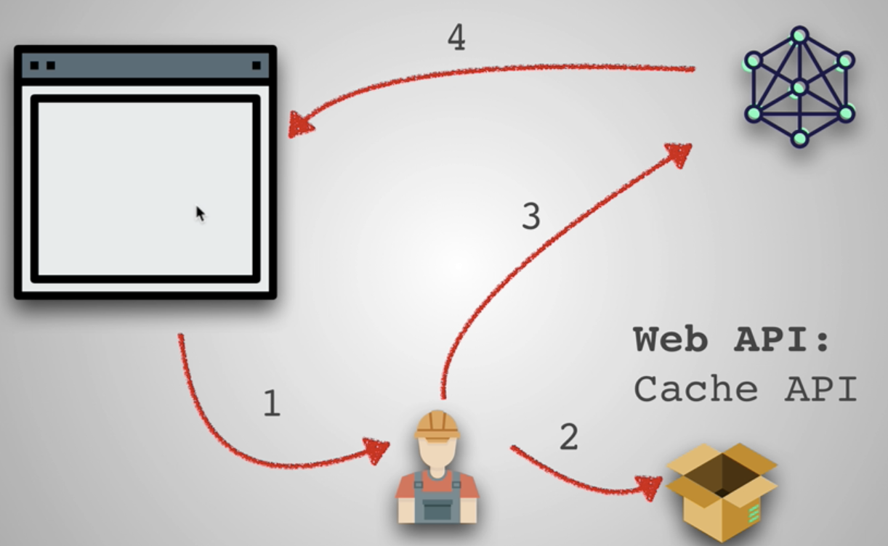

# Progressive Web Apps (PWA)

PWAs are user experiences that have the reach of the web, and are:

- Reliable : Load instantly and never show the downasaur, even in uncertain network conditions.
- Fast : Respond quickly to user interactions with silky smooth animations and no janky scrolling.
- Engaging : Feel like a natural app on the device, with an immersive user experience.

You can use **Lighthouse** to help you turn a web app into a PWA.

`create-react-app` sets a PWA out of the box for us.

**Resources :**

- [Submitting PWA to 3 app stores](http://debuggerdotbreak.judahgabriel.com/2018/04/13/i-built-a-pwa-and-published-it-in-3-app-stores-heres-what-i-learned/)
- [PWA Android vs iOS](https://medium.com/@firt/progressive-web-apps-on-ios-are-here-d00430dee3a7)

## HTTPS

HTTPS is an extension of HTTP for secure communication over a computer network. The communication protocol is encrypted using Transport Layer Security.

HTTPS helps prevent intruders from tampering with the communications between your websites and your users’ browsers. It also protects the privacy and security of your users.

All sites hosted on GitHub Pages are using HTTPS.

**Resources :**

- [Let's encrypt](https://letsencrypt.org/how-it-works/)
- [PWA Checklist](https://developers.google.com/web/progressive-web-apps/checklist)

## App manifest

Simple `.json` file that allows us to control how the app should appear in certain areas like in homescreen, how the app should launch, etc.

Tapping on the app will launch a splash screen (background-color and color can be customized)

**Resources :**
 
 - [Viewport meta tag](https://developers.google.com/web/tools/lighthouse/audits/has-viewport-meta-tag)
 - [Favicon generator](https://realfavicongenerator.net/)

## Service worker

A service worker is a script that your browser runs in the background separate from the web page webapp. It is generally used for features that don't need user interaction.

In a progressive Web app the service worker acts as what we call a network proxy. It intercepts any requests made first to the network.

**Resources :** 

- [How to implement it](https://github.com/jeffposnick/create-react-pwa/compare/starting-point...pwa)
- [Is SW ready ?](https://jakearchibald.github.io/isserviceworkerready/)
- [Push notifications](https://auth0.com/blog/introduction-to-progressive-web-apps-push-notifications-part-3/)

