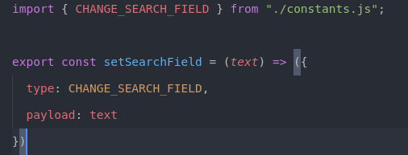
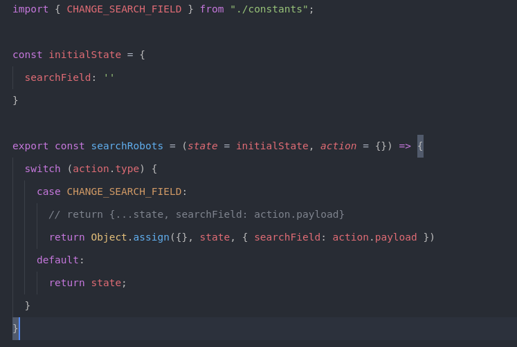
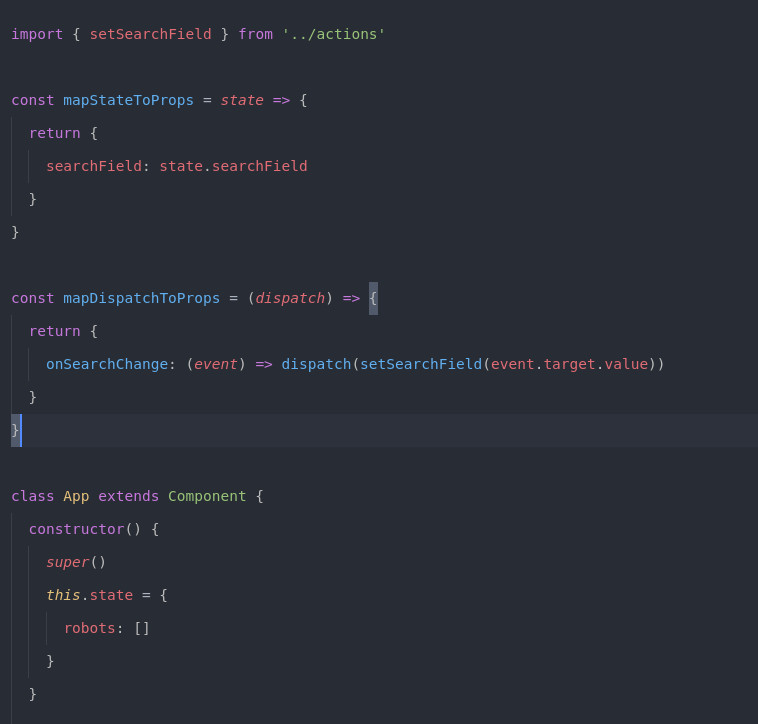
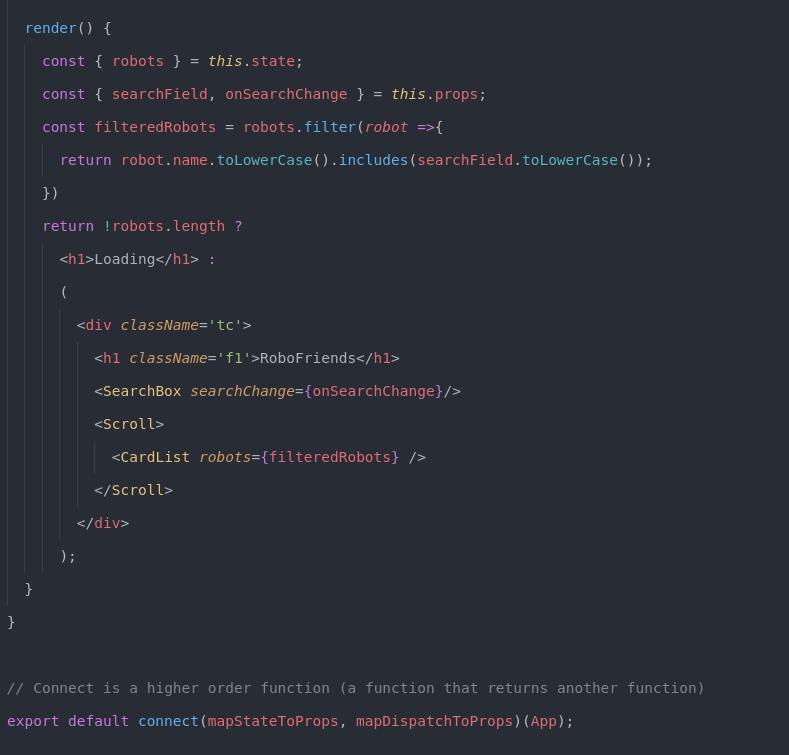
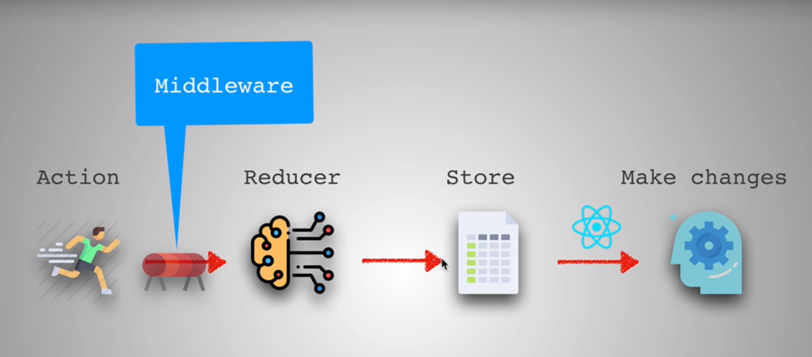

# React & Redux

An app needs to remember things in order to work : that's why we need **state management**

**3 principles**

**Redux's features**

## State

State management becomes a problem when the app gets more and more complicated.

Redux concept : components have just **props**, there is one massive object which is called the **store** and contain the state.

**Flux pattern**

The big state in React above becomes this state :

## Actions

## Reducers

## Store and provider

## Connect

There are two kind of components : **containers** and **components**

Containers are smart components. They know about the state of the app.

## Middlewares

A middleware listens for actions. It's a tunnel that actions go through and depending on the middleware, it can modify the action or trigger another one before hitting the reducer.

## Asynchronous actions

Use [Redux Thunk](https://github.com/reduxjs/redux-thunk)

It waits and sees if any actions returns a function instead of an object.

Thus, an asynchronous action must be a higher order function. Redux thunk will listen to actions and give the `dispatch` function.

## Project Structures

There's two ways of doing things : 

1. Classic structure
    - `actions`
    - `reducers`
    - `containers`
    - `components`
    - `...`

But this can get pretty messy as the app is growing bigger and bigger.

2. Features structure
    - `Search`
        - `Search.js`
        - `actions.js`
        - `reducer.js`
        - `...`
    - `Signup`
        - `...`

## Popular tools

**Routing**
- [React Router](https://reacttraining.com/react-router/)

**Utilities**
- [Ramda](https://ramdajs.com/)
- [Lodash](https://lodash.com/)

**Styling**
- [Glamorous](https://glamorous.rocks/)
- [Styled components](https://www.styled-components.com/)
- [CSS Modules](https://github.com/css-modules/css-modules)

**Static page**
- [Gatsby](https://www.gatsbyjs.org/)

**Server-side rendering**
- [Next.js](https://nextjs.org/)

**CSS Frameworks**
- [Material UI](https://material-ui.com/)
- [Semantic UI](https://react.semantic-ui.com/)

**Redux libraries**
- [Reselect](https://github.com/reduxjs/reselect)
- [Redux Saga](https://github.com/redux-saga/redux-saga)
- [Immutable](https://facebook.github.io/immutable-js/)

We don't need to always use it ! We have to see if we can actually benefit from the libraries to use it.