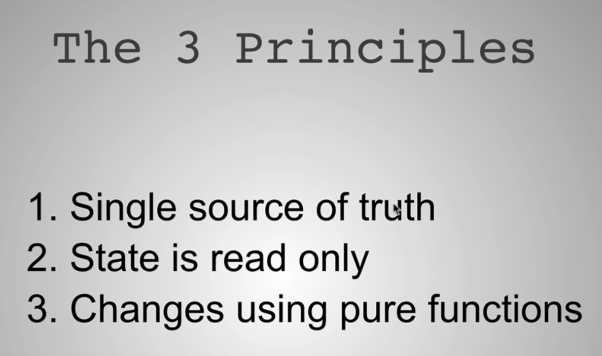
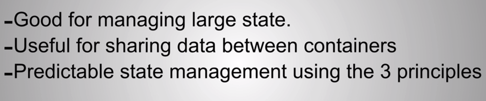
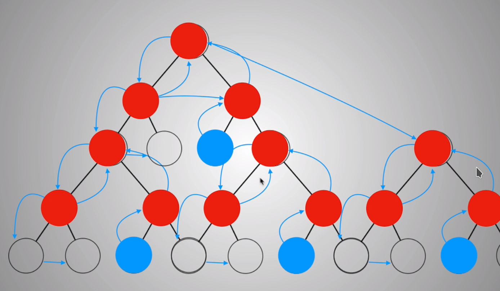
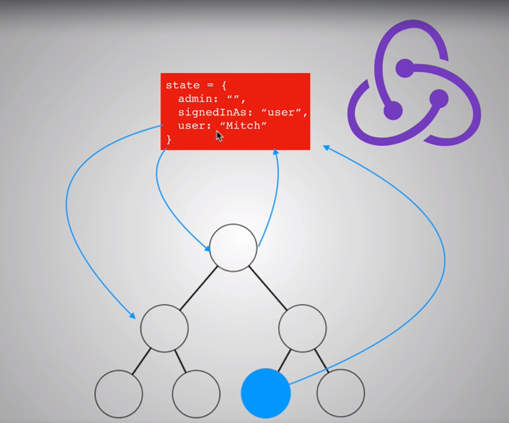
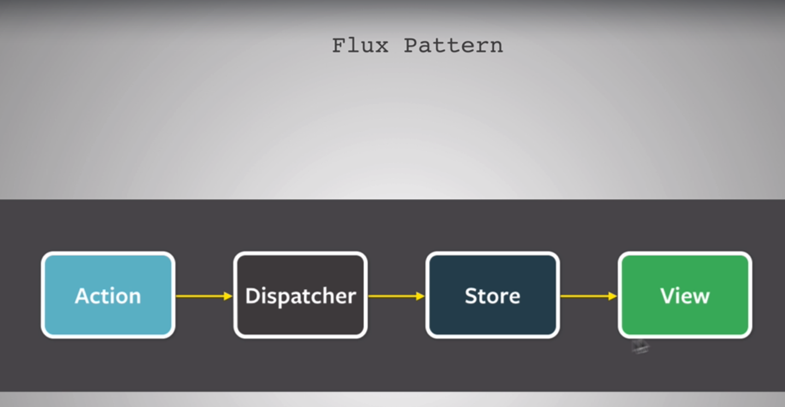
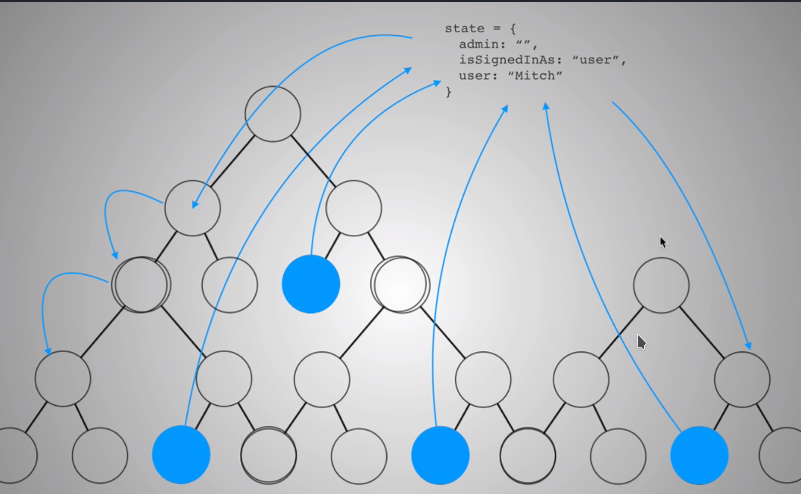

# Redux

An app needs to remember things in order to work : that's why we need **state management**

**3 principles**

**Redux's features**

### Talking about state

State management becomes a problem when the app gets more and more complicated.

Redux concept : components have just **props**, there is one massive object which is called the **store** and contain the state.

**Flux pattern**

The big state in React above becomes this state :

