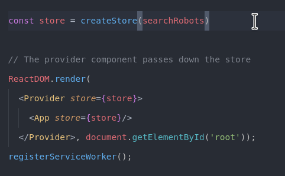

# React & Redux

An app needs to remember things in order to work : that's why we need **state management**

**3 principles**

**Redux's features**

## State

State management becomes a problem when the app gets more and more complicated.

Redux concept : components have just **props**, there is one massive object which is called the **store** and contain the state.

**Flux pattern**

The big state in React above becomes this state :

## Actions

## Reducers

## Store and provider

## Connect

There are two kind of components : **containers** and **components**

Containers are smart components. They know about the state of the app.

## Middlewares

A middleware listens for actions. It's a tunnel that actions go through and depending on the middleware, it can modify the action or trigger another one before hitting the reducer.

