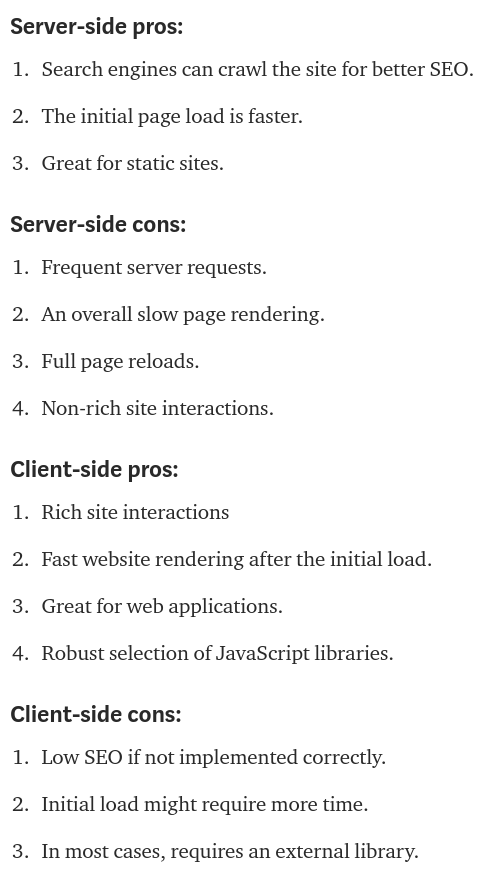
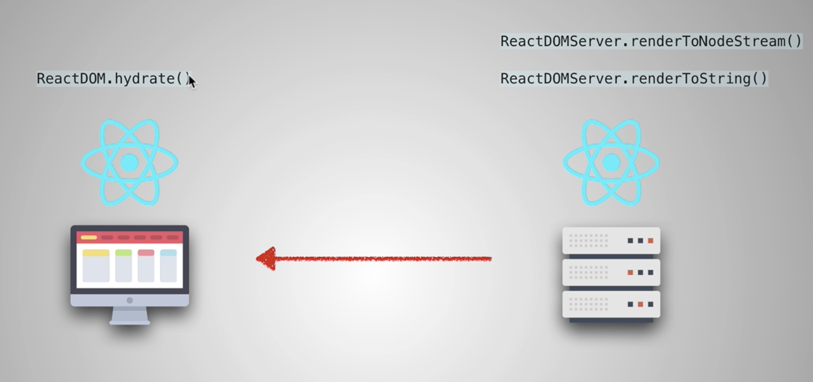
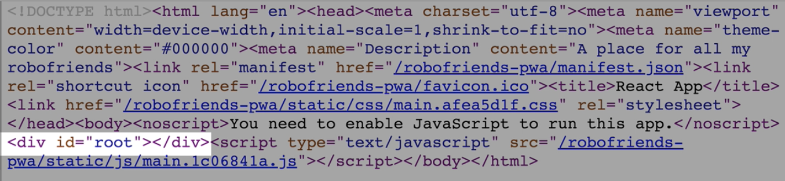
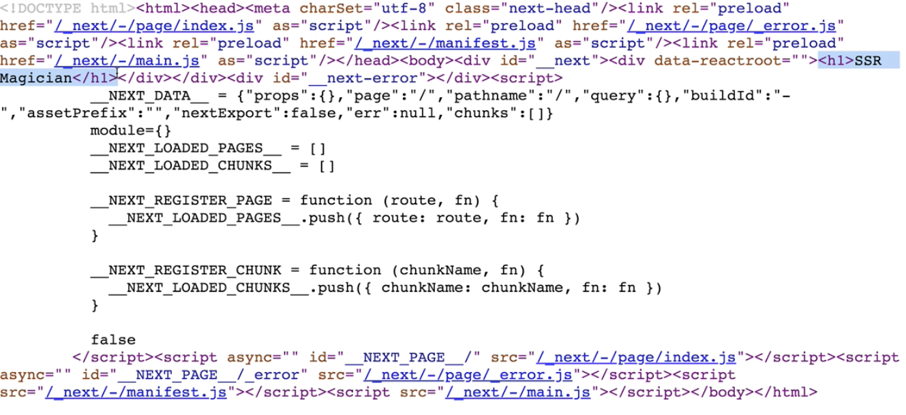

# Server Side Rendering

## How SSR works

Whenever you visit a website, your browser makes a request to the server that contains the contents of the website. Once the request is done processing, your browser gets back the fully rendered HTML and displays it on the screen. If you then decide to visit a different page on the website, your browser will once again make another request for the new information. This will occur each and every time you visit a page that your browser does not have a cached version of.

## How CSR works

When developers talk about client-side rendering, they’re talking about rendering content in the browser using JavaScript. So instead of getting all of the content from the HTML document itself, you are getting a bare-bones HTML document with a JavaScript file that will render the rest of the site using the browser.

## Pros and cons



## Server side rendering in React

We use the method `renderToString` from `react-dom`.

All we're doing is converting our React app to string.

We render the app on the server with robots already created. So it will appear a lot faster.

We need React on the browser and the server.

We use these methods :



`ReactDOM.hydrate()` is like calling the render method except it preserve markup and only attach event listeners, or any JS functionalities. Otherwise, there will be just text displayed.

To sum up, `hydrating` makes the page interactive.

`ReactDOMServer.renderToNodeStream` : similar to `renderToString` except it uses nodes stream that makes the process faster.

## Why CSR has a low SEO potential

We just render a simple HTML file. When the crawlers programs look at the webpages, it only sees something like that :

`<div id="root"></div>`

We can improve the SEO by putting a `meta` description tag but it won't be enough. Furthermore, if we're doing AJAX requests at the initial load, the rendering will be slower.

So if we need a website that depends on SEO (hotel companies for example), we need SSR because the content is presented before we actually get it in the view.

## SSR React libraries

- [Gatsby](https://www.gatsbyjs.org/) : Great for static pages, documentations. React documentation uses Gatsby !
- [Next](https://nextjs.org/learn/) : For apps beyond static pages. Easy to use and one of the best implementation of SSR. They include code splitting, SEO optimization, ...

## Setting up Next.js

Includes :

- Routing
- Webpack set up
- Use different types of CSS
- Support for TypeScript
- etc.

We need a `pages` folder at the root.

### DOM differences

#### Client-side



#### Server-side



### Code

`package.json`

```json
{
  "name": "next-ssr",
  "version": "1.0.0",
  "main": "index.js",
  "license": "MIT",
  "scripts": {
    "start": "next"
  },
  "dependencies": {
    "next": "^6.1.1",
    "react": "^16.4.1",
    "react-dom": "^16.4.1"
  }
}
```

`pages/index.js`

```js
// Allows to do client-side routing (check the network tab in Chrome)
import Link from "next/link";

const Index = () => (
  <div>
    <h1>SSR Magician</h1>
    <Link href="/about">
      <button>About</button>
    </Link>
    {/* <a href="/about">About</a> */}
  </div>
);

export default Index;
```

`pages/about.js`

```js
import Link from "next/link";

const About = () => (
  <div style={{ fontSize: "20px", color: "blue" }}>
    <h1>About</h1>
    <Link href="/">
      <button>Back</button>
    </Link>
    <p>I was a magician once</p>
  </div>
);

export default About;
```

## Resources

[Client-side rendering vs Server-side rendering](https://medium.freecodecamp.org/what-exactly-is-client-side-rendering-and-hows-it-different-from-server-side-rendering-bd5c786b340d)
