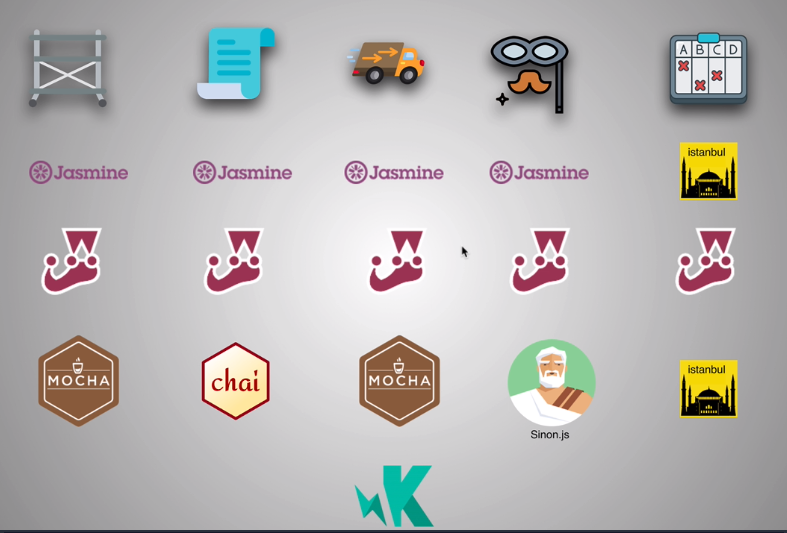
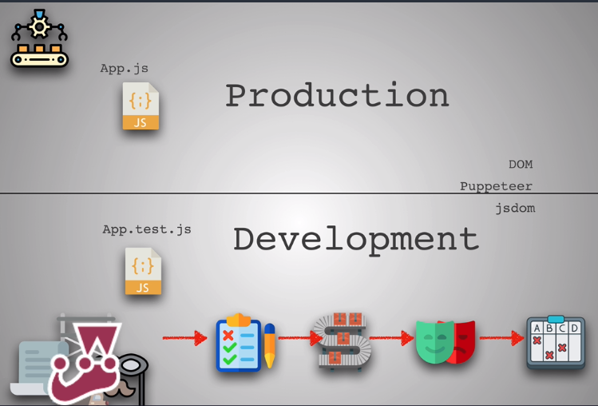

# Tests

## Types of test

- Unit tests : 
  - Involves breaking your program into pieces, and subjecting each piece to a series of tests.
  - 90% of the tests are usually unit tests.
  - We should separate our components into clean small chunks in order to make unit tests easier.
- Integration tests : 
  - It's all about cross-communication between different units of code
  - We can use spies and stubs to mock and modify parts of a process (mock database call, ...)
  - They can really be fragile and harder to write
  - Always start with unit tests and then integration tests
- Automation tests (UI Tests) : 
  - This can also be called end-to-end testing
  - test real life scenarios on the browser by controlling the browser and making sure that the expected behavior on the web is correct. Humans can do this or robots.
  - They are the hardest to set up
  - Tools : Nightmare, cypress, TestCafé, ...

### Libraries



`create-react-app` has Jest already set up.

We can also use [enzyme](http://airbnb.io/enzyme/).

### Workflow



### Writing tests

**package.json**

```js
{
  ...
  "scripts": {
    "test": "jest --watch *.js"
  },
  ...
  "devDependencies": {
    "jest": "^23.2.0"
  }
}
```

**script.js**

```js
const googleDatabase = [
  'cats.com',
  'souprecipes.com',
  'flowers.com',
  'animals.com',
  'catpictures.com',
  'myfavouritecats.com',
  'myfavouritecats2.com'
];

// The db parameter makes the googleSearch function more extensible
const googleSearch = (searchInput, db) => {
  const matches =  db.filter(website => website.includes(searchInput));
  return matches.length > 3 ? matches.slice(0, 3) : matches
}

// We don't have babel or webpack so we'll use require
module.exports = googleSearch;
```

**script.test.js**

```js
// We don't have babel or webpack so we'll use require
const googleSearch = require('./script')

// Pretend that we have a database
let dbMock = [
  'dog.com',
  'cheesepuff.com',
  'disney.com',
  'dogpictures.com'
];

describe('googleSearch', () => {
  it('is searching google', () => {
    expect(googleSearch('testtest', dbMock)).toEqual([]);
    expect(googleSearch('dog', dbMock)).toEqual(['dog.com', 'dogpictures.com']);
  })
  
  it('work with undefined and null input', () => {
    expect(googleSearch(undefined, dbMock)).toEqual([]);
    expect(googleSearch(null, dbMock)).toEqual([]);
  })
  
  it('does not return more than 3 matches', () => {
    expect(dbMock.length).toBeGreaterThan(3)
    expect(googleSearch('.com', dbMock).length).toEqual(3);
  })  
})
```

