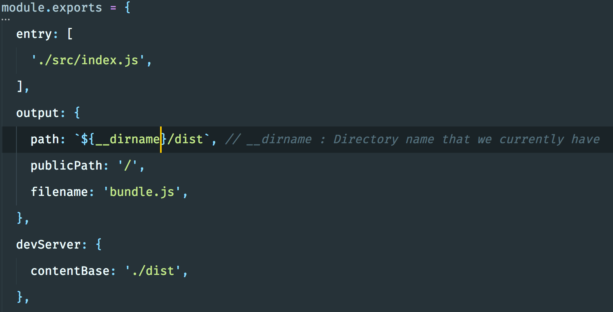
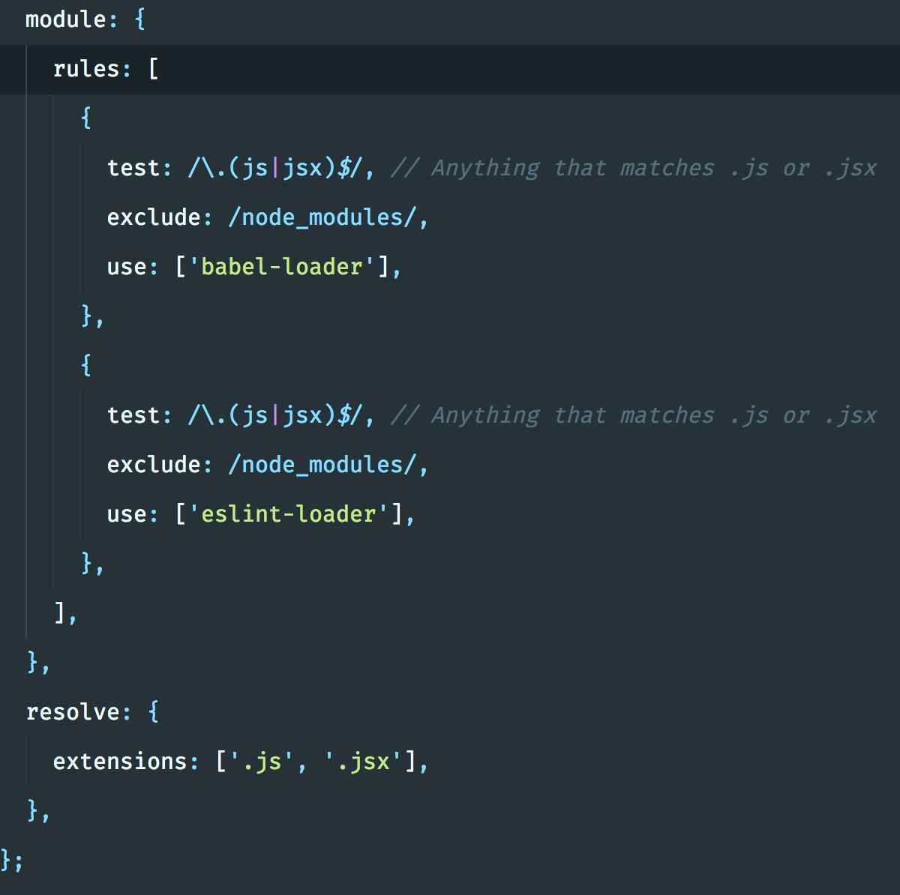
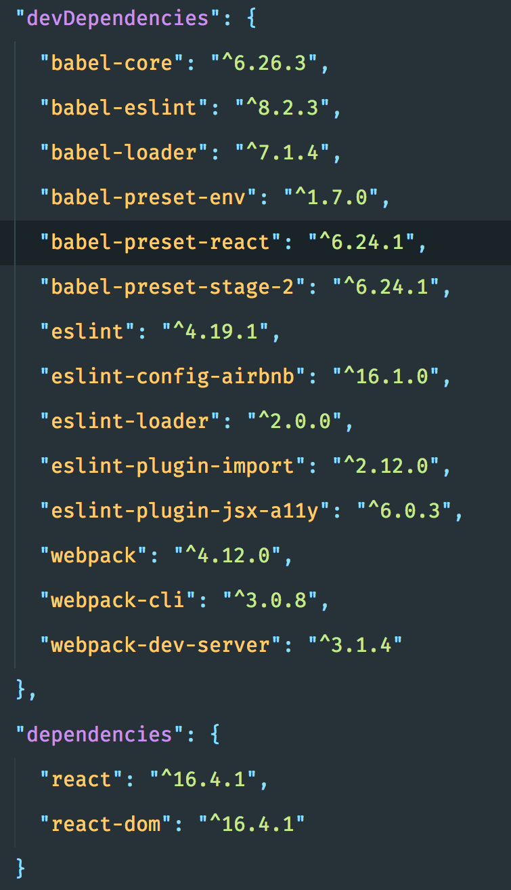
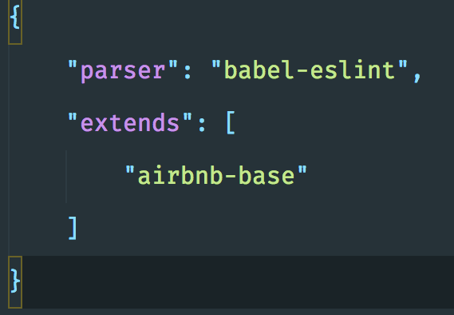
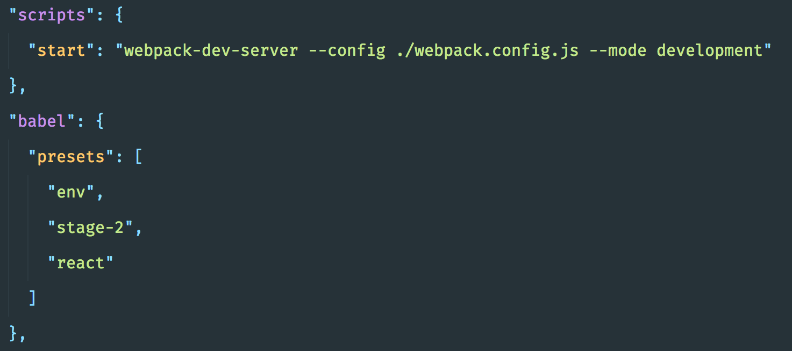
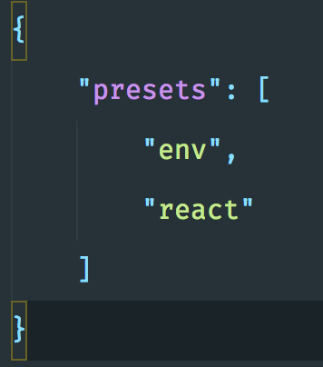

# Bundling

When we care about performance and bundling all of our JavaScript files (or CSS), minify them, we need to use a module bundler.

`create-react-app` does a really great job but we need to know how it works under the hood.

### Tools

- [Webpack](https://webpack.js.org/) : large projects
- [Rollup](https://rollupjs.org/guide/en) : rolling out npm packages
- [Parcel](https://parceljs.org/) : small project, personal project

Things are always evolving so we don't need to read every bit of the docs.

## Webpack

There's two tools :

- Loaders
- Plugins

All the javascript code is contained in a `bundle.js` file.

Here is all the dependencies you need :

- Babel is a transpiler. It allows us to write ES6 code that gets transpiled into ES5 code. 
- For every `js` or `jsx` file, we use the babel loader and eslint loader.

**ESLint config**

**Babel config and the script**

- The `mode` is new (webpack 4!)

We can also use the `babelrc` file :

## Parcel

Parcel is really easy to use compared to webpack.

We just have to add the package `parcel-bundler` and then use `parcel index.html`. It will automatically bundle the files.